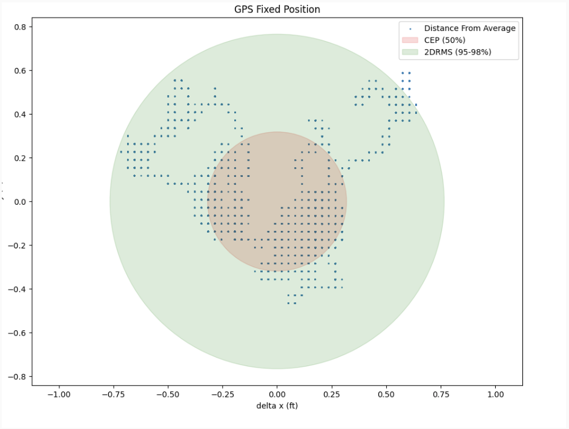

# GPS Autonomous Navigation

## An exploration into autonomous navigation with a GPS

You can use the [editor on GitHub](https://github.com/neghena/GPS_Autonomous_Nav/edit/gh-pages/index.md) to maintain and preview the content for your website in Markdown files.

### Background 

Our team’s project in the context of our domain is to build an autonomous GPS-based navigation system that will be robust and reliable enough to be competitive in a race. The challenge in doing so primarily comes down to understanding the shortcomings of the GPS being used so that its problems can be mitigated through supplementary methods. In addition to the differences in accuracy between GPS products at different price points, GPS’s in general tend to suffer from issues of signal interference which lead to delays in positioning updates and lack of precision as well as oscillating data even when left at a fixed position. To build a navigation system for a vehicle that will travel at high speeds, it is crucial that vehicle positioning is provided accurately and quickly. The hurdle for our project, then, is to create a reliable navigation system using GPS that can update instantaneously and precisely despite these being the characteristic issues that plague the GPS.


### GPS Comparisons: 1 Unit vs 2 Unit RTK 

One unit: 
-  For the 1-Unit RTK, CEP is 0.318 feet and 2DRMS is 0.766 feet.
Two Unit: {work in progress}
- Description


### GPS Solo Navigation
Maybe some rviz photos & explanations of solo navigation

### GPS & IMU Autonomous Navigation 
 


---- extra stuff ---- 

Markdown is a lightweight and easy-to-use syntax for styling your writing. It includes conventions for

```markdown
Syntax highlighted code block

# Header 1
## Header 2
### Header 3

- Bulleted
- List

1. Numbered
2. List

**Bold** and _Italic_ and `Code` text

[Link](url) and 
```

For more details see [GitHub Flavored Markdown](https://guides.github.com/features/mastering-markdown/).

### Jekyll Themes
