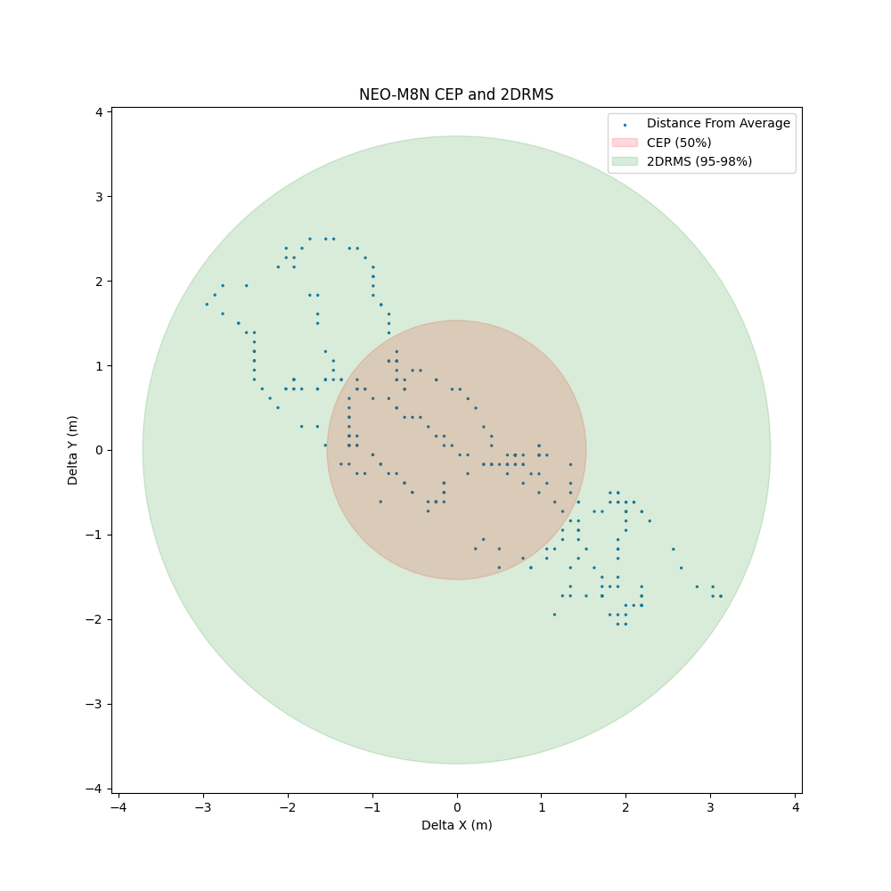
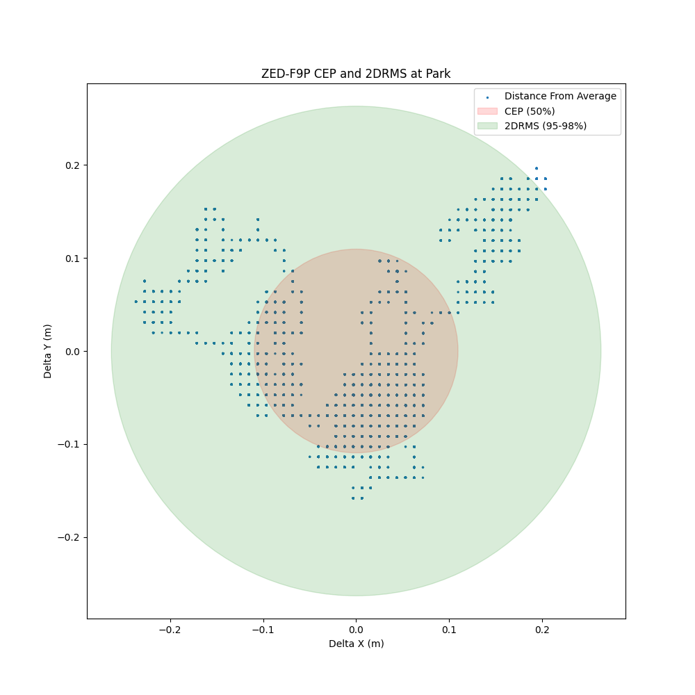
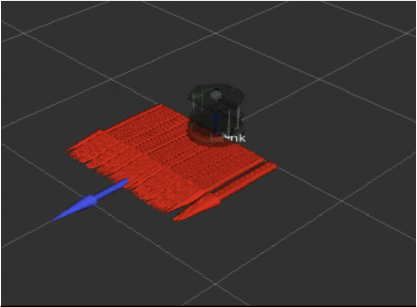
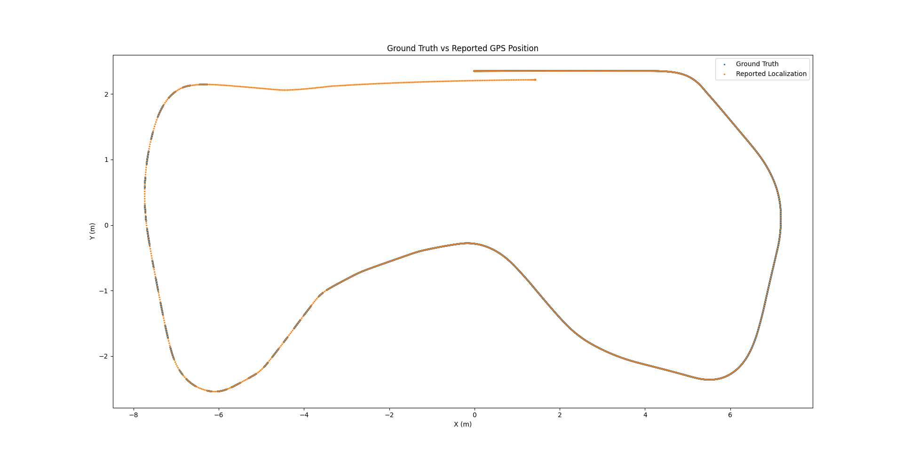
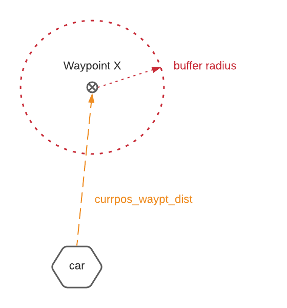
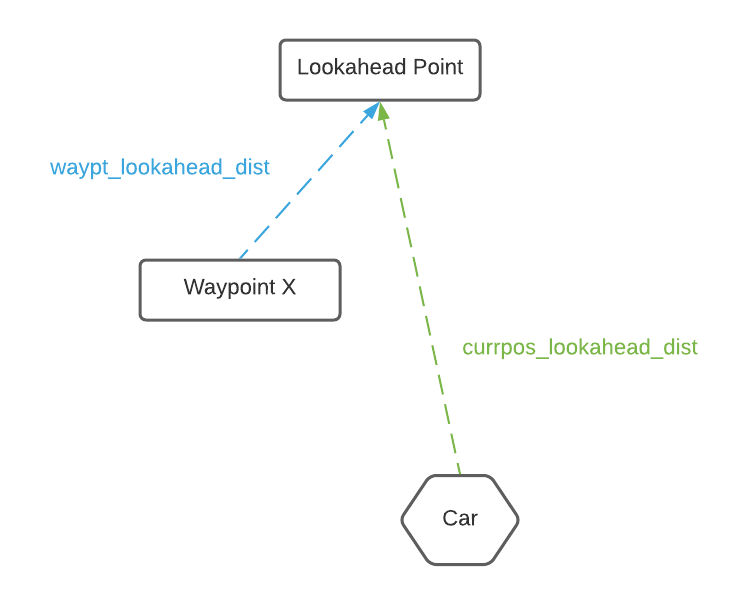
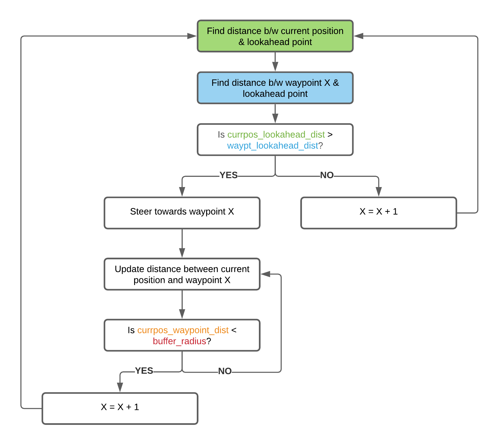

![map](Images/map.png 

## An exploration into autonomous navigation built around GPS

### Our Project 

Our team’s project in the context of our domain is to build an autonomous GPS-based navigation system. The challenge in this project primarily comes down to understanding the shortcomings of the GPS being used so that its problems can be mitigated through supplementary methods. Not mentioning the differences in accuracy between GPS products at different price points, GPS’s in general tend to suffer from issues of signal interference which lead to delays in positioning updates and lack of precision as well as oscillating data even when left at a fixed position. To build a navigation system for a vehicle that will travel at high speeds, it is crucial that vehicle positioning is provided accurately and quickly. The hurdle for our project, then, is to create a reliable navigation system using GPS that can update instantaneously and precisely despite these being the inherent issues that plague the GPS.

### Part 1: GPS Selection

NEO-M8N Performance            |  ZED-F9P Performance
:-------------------------:|:-------------------------:
  |  

- For the ZED-F9P, CEP is 0.097 meters and the 2DRMS is 0.233 meters.
- For the NEO-M8N, CEP is 1.532 meters and the 2DRMS: 3.710 meters.

Finding a GPS accurate enough was a crucial part of our project as a navigation system built on a faulty GPS can only be so reliable. 
To do this, we had to find metrics and develop testing procedures to compare the two GPS models that we had. The graphs above are the 
results that we obtained from testing u-blox's NEO-M8N and ZED-F9P From these results, we can see that the ZED-F9P performs significantly 
better then the NEO-M8N. Thus we chose this GPS for the purposes of developing an autonomously navigating vehicle! 

### Part 2: Sensor Fusion
 
Even with more accurate GPS sensors, there are still a few shortcomings that are unavoidable, such as slower frequency of messages, and 
lack of orientation data. So we also use IMU and odometry data to provide us the data we can't get from the GPS. Fusing all three together
will allow us to get a much more accurate localization. Specifically, we use the state estimation aglorithm, the Extended Kalman Filter (EKF), 
to produce a high level of accuracy of where the vehicle is based on readings from the IMU, odometry and GPS.

Each of the red arrows is a reading of the vehicle’s positioning and orientation as the vehicle remains in a stationary point. 
We simulated some noise in the y-axis specifically so the readings are erratic along the y-axis even though the vehicle has not moved. 
The blue arrow is the noisy odometry and IMU data after it has been filtered by EKF. There are actually multiple blue arrows stacked 
on top of each other as EKF filters out each noisy reading to produce a consistent vehicle positioning. Compared to the raw odometry
and IMU data, you can see that filtering noisy data using EKF data is much more accurate to the vehicle’s positioning in both the x and y direction. 

### Part 3: Global Path Planning

Our simulated tests of the vehicle proved to be successful! Over the course of a full lap around the UCSD Warren track, the EKF algorithm was able to reduce the error in localization error essentially down to zero. 

### Waypoint Selection and Navigation

We set a buffer radius for each waypoint we want to go to so that we don't "miss" a waypoint & make incorrect navigation choices just because noisy data. 

We use a lookahead point to determine if we've reached our current waypoint. 

An overview of exactly how waypoint navigation would be determined. 

### Our Final Result & Presentation!

<iframe width="560" height="315" src="https://www.youtube.com/embed/DJktMnLdI_I" frameborder="0" allow="accelerometer; autoplay; clipboard-write; encrypted-media; gyroscope; picture-in-picture" allowfullscreen></iframe>

