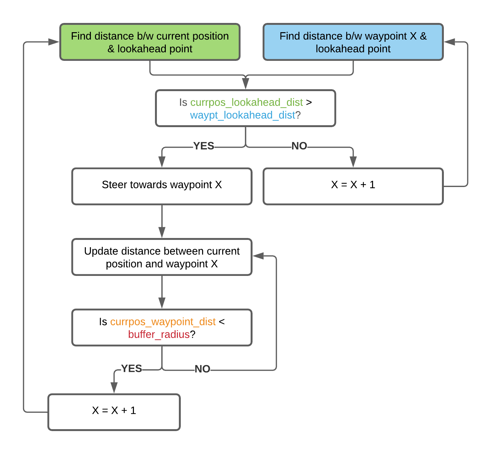

An exploration in autonomous driving built around the GPS

 
 

### Background

Our team’s project in the context of our domain is to build an autonomous GPS-based navigation system. The challenge in this project primarily comes down to understanding the shortcomings of the GPS being used so that its problems can be mitigated through supplementary methods. Not mentioning the differences in accuracy between GPS products at different price points, GPS’s in general tend to suffer from issues of signal interference which lead to delays in positioning updates and lack of precision as well as oscillating data even when left at a fixed position. To build a navigation system for a vehicle that will travel at high speeds, it is crucial that vehicle positioning is provided accurately and quickly. The hurdle for our project, then, is to create a reliable navigation system using GPS that can update instantaneously and precisely despite these being the inherent issues that plague the GPS. 

 
The next 5 sections will be brief summaries of each stage of our project. For a more detailed look and explanation, please refer to our [presentation](https://www.youtube.com/embed/DJktMnLdI_I "Presentation").

 
 

### Part 1: GPS Selection

Finding a GPS accurate enough was a crucial first step of our project since a navigation system built on a faulty GPS can only be so reliable. 
To do this, we needed metrics to evaluate the two GPS models that we had: u-blox's NEO-M8N and ZED-F9P. We use Circular Error Probable (CEP) and 2D Root Mean Square (2DRMS) to do so. We can interpret the metrics as follows:

1. A CEP of 5 meters lets us know that for 50% of the GPS outputs, we can expect the output to be within 5 meters of the true position. 
2. A 2DRMS of 5 meters lets us know that for 95% of the GPS outputs, we can expect the output to be within 5 meters of the true position.

The graphs below are the results that we obtained from quality testing u-blox's NEO-M8N and ZED-F9P.

NEO-M8N Performance            |  ZED-F9P Performance
:-------------------------:|:-------------------------:
  |  

- For the ZED-F9P, CEP is 0.097 meters and the 2DRMS is 0.233 meters.
- For the NEO-M8N, CEP is 1.532 meters and the 2DRMS: 3.710 meters.

From these results, we can see that the ZED-F9P performs significantly 
better then the NEO-M8N. Thus, we chose the ZED-F9P to fit onto our vehicle. 

 
For more details of how we tested our GPS, please refer to
our presentation starting at [2:05](https://youtu.be/DJktMnLdI_I?t=125 "Presentation"). 

 
 

### Part 2: Sensor Fusion
 

In order to navigate with a GPS, an accurate vehicle heading is just as necessary as an accurate position. By integrating odometry, IMU, and GPS data together, we can obtain both vehicle position and orientation. To accomplish this task, we used a state estimation algorithm, Extended Kalman Filter (EKF). EKF takes in the positional information from the GPS, the acceleration and orientation data from the IMU, and the velocity measurements from both odometry and IMU to filter out noisy readings from each sensor. It provides us with an estimate of the current vehicle location more accurately than these three sensors can provide on their own and allows us to directly combine three separate data streams into a single source that contains both an accurate position and orientation. The picture below is a demonstration of EKF's accuracy. 

Each of the red arrows is a reading of the vehicle’s positioning and orientation as the vehicle remains in a stationary point. 
We simulated some noise in the y-axis specifically so the readings are erratic along the y-axis even though the vehicle has not moved. 
The blue arrow is the odometry and IMU data after it has been filtered by EKF. There are actually multiple blue arrows stacked 
on top of each other as EKF filters out each noisy reading to produce a consistent vehicle positioning. Compared to the raw odometry
and IMU data, you can see that filtering noisy data using EKF data is much more accurate to the vehicle’s positioning in both the x and y direction. 

Over the course of a full lap around the UCSD Warren track, the EKF algorithm was able to reduce the error in vehicle localization essentially down to zero. 

 
For more details of sensor fusion, please refer to our presentation starting at [6:40](https://youtu.be/DJktMnLdI_I?t=394 "Presentation"). 

 
 

### Part 3: Global Path Planning
Creating an autonomous navigation system that is only reliant on GPS is essentially the same thing as driving blindfolded. To base navigation purely on GPS, the first requirement is to obtain a detailed map of the desired track to race on. This navigation map is a binary masked image where white indicates allowable driving area and black represents non-drivable areas. Using the Thunderhill Raceway track in Willows, CA we obtained high resolution satellite images that served as a basis for a navigation map. From this satellite image, a combination of both automatic and manual image processing techniques can be used to create the final binary mask. 

Thunderhill Satellite           |  Thunderhill Binary Mask
:-------------------------:|:-------------------------:
  |  

Once a mask is created, it is possible to implement navigation algorithms that will generate a feasible path for the vehicle. The feasible path will consist of waypoints between the start and endpoint. The idea is that between any pair of points, there exists a straight path and the vehicle can just follow one of these straight paths until it reaches a waypoint, rotate to the angle of the new straight path, and so on until it reaches its destination. 

 
For more details of global path planning and waypoint creation, please refer to our presentation starting at [9:00](https://youtu.be/DJktMnLdI_I?t=535 "Presentation"). 

 
 

### Part 4: Waypoint Selection and Navigation

One of the major challenges in waypoint navigation lies in the noisy nature of a GPS. Even if the vehicle reaches the exact position of the waypoint, the localization output may not match the waypoint coordinates, which could result in the vehicle going off-track or even turning around. To circumvent this issue, we set a buffer radius from the waypoint coordinate such that if the distance between the current vehicle position and waypoint is within this radius, the vehicle is considered to have reached the waypoint and can head towards the next. The buffer radius is based on the calculated CEP/2DRMS of the GPS in use as well as the distance between consecutive waypoints in a generated path. If the generated path has waypoints that are 0.1 meters apart with a buffer radius of 0.2 meters, then the vehicle may end up skipping waypoints. The diagram below demonstrates the concept of the buffer radius. 

To determine if a waypoint has been reached, we first determine a lookahead point, a waypoint that is k waypoints ahead, for each waypoint. We also calculate distance between the current vehicle position and lookahead point, distance between current waypoint and lookahead point, and distance between current vehicle position and current waypoint. If the distance between current vehicle position and lookahead position is greater than the distance between current waypoint and lookahead point, then the vehicle has not reached the current waypoint yet. The vehicle should continue heading towards this waypoint and should continuously update the distance between its current position and the waypoint to determine if it is within the buffer radius. Once it is within the buffer radius, the vehicle has reached the waypoint and can start at step 1 again for the next waypoint. This algorithm continues until all waypoints have been reached. The diagrams below demonstrate the concept.

Waypoint Confirmation FlowChart           |  Distance Calculation
:-------------------------:|:-------------------------:
  |  

Once there is a reliable method for the vehicle to determine which waypoint to head towards, autonomous navigation can be simplified into determining steering angle and velocity values to send to the vehicle. When waypoint X has been reached, a new steering angle should be calculated so that the vehicle can point towards waypoint X+1 and can now, theoretically, just travel down the path between waypoint X and waypoint X+1 to reach waypoint X+1. We do a simple check to see if the current vehicle heading is the same as the upcoming waypoint’s orientation. If they are equal, there is no need to change the current steering angle, otherwise, we use a PD controller to determine the steering angle for the car based on the heading it needs to go to. 

 
For more details on waypoint navigation, please refer to our presentation starting at [10:30](https://youtu.be/DJktMnLdI_I?t=634 "Presentation"). 

 
 

### Our Final Result & Presentation

For a demonstration of autonomous navigation, please refer to the our presentation starting at [15:25](https://youtu.be/DJktMnLdI_I?t=925 "Presentation").

<iframe class="align-center" width="560" height="315" src="https://www.youtube.com/embed/DJktMnLdI_I" frameborder="0" allow="accelerometer; autoplay; clipboard-write; encrypted-media; gyroscope; picture-in-picture" allowfullscreen></iframe>

